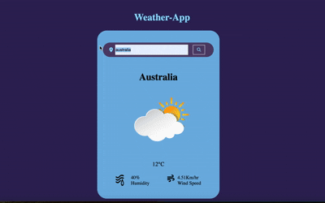

# WeatherApp

This is a basic weather app I created to learn how to fetch APIs and manipulate the data received from them.

The project uses:
- **HTML** for structure
- **Vanilla CSS** for styling
- **Vanilla JavaScript**, including modern features like Fetch API, async/await, and basic DOM manipulation

It helped me understand asynchronous data handling and how to build responsive front-end applications using JavaScript.

**API USED**:[OpenWeatherMap](https://openweathermap.org/api)

## Features

- 🔍 **Search by City Name**  
  Users can enter the name of any city in the navbar's input field. Upon clicking the search icon, the app fetches and displays real-time weather data for that location using the OpenWeatherMap API.

- 🌡️ **Displays Key Weather Info**  
  Shows temperature, weather condition (like cloudy, sunny, etc.) and also shows the current humidity along with windspeed

- ⚡ **Live API Integration**  
  Real-time data is fetched using modern JavaScript (`fetch`, `async/await`).

- 🎨 **Clean & Responsive UI**  
  Built with HTML, CSS, and vanilla JS for a simple yet responsive front-end
## Demo
